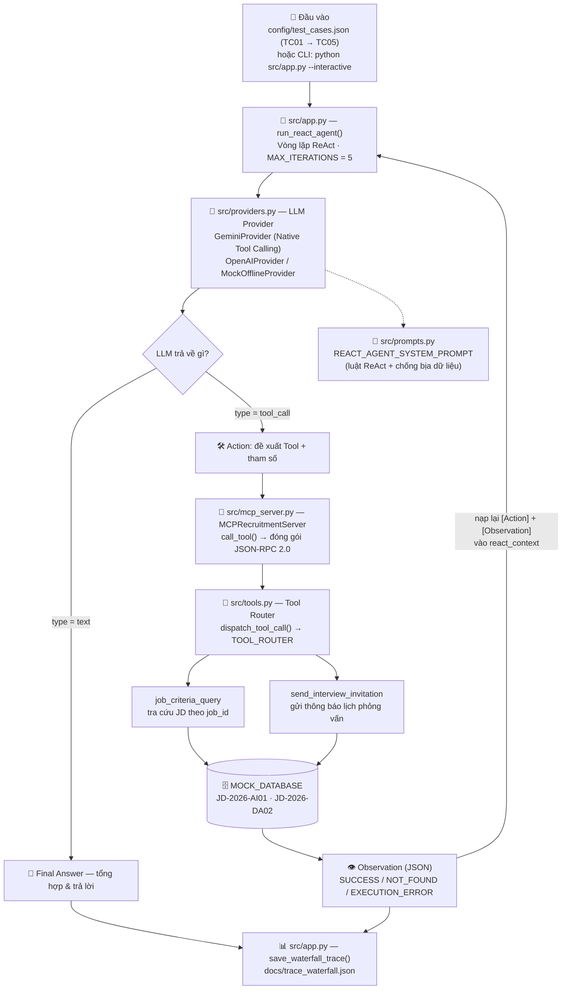

# 🧭 TỔNG QUAN ĐỀ TÀI — TRỢ LÝ TUYỂN DỤNG & SÀNG LỌC CV

> **Học viên:** Lê Việt Hoàng · **MSSV:** 2A202602596
> **Bài lab:** Day 03 — Từ Chatbot đến Agentic Agent (ReAct + MCP Server)
> **Repo:** https://github.com/viethg/K4B-Day03-LeVietHoang-2A202602596

---

## 1. Chọn đề tài gì? Vì sao chọn?

**Đề tài:** *Trợ lý Tuyển dụng & Sàng lọc CV* — Gợi ý **4.1** trong `docs/DANH_SACH_DE_TAI.md`.

**Hai nghiệp vụ Agent đảm nhiệm:**
1. **Tra cứu tiêu chí tuyển dụng (JD)** của một vị trí theo **mã vị trí**.
2. **Gửi thông báo lịch phỏng vấn** cho ứng viên đã qua vòng sàng lọc CV.

**Lý do chọn (pain point thực tế của HR):**

| Nỗi đau | Hệ quả |
| :--- | :--- |
| Thông tin phân tán: JD một nơi, danh sách ứng viên một nơi, lịch phỏng vấn nằm ở email/lịch cá nhân | Tra cứu thủ công mất thời gian, dễ bỏ sót ứng viên |
| Tiêu chí mỗi vị trí khác nhau và được cập nhật liên tục | Dễ đối chiếu CV theo **phiên bản JD cũ** → sàng lọc sai người |
| Gửi thư mời phỏng vấn hoàn toàn thủ công | Sai giờ / sai vị trí / quên người phụ trách; **không có log truy vết** |
| Quy trình có **phụ thuộc bước trước**: muốn mời đúng người phỏng vấn thì phải tra đúng JD trước | Không thể tự động hoá bằng script tuyến tính đơn giản |

**Vì sao cần Agent, không phải Chatbot?** Chatbot chỉ trả lời theo kiến thức có sẵn: **không truy cập được dữ liệu thời gian thực và không thực hiện được hành động**. Bài toán này cần đúng 3 thứ mà Chatbot không có:
1. Gọi **công cụ** để lấy dữ liệu nằm ngoài LLM (JD theo mã vị trí).
2. **Dùng kết quả vừa lấy để quyết định bước tiếp theo** (lấy Hiring Manager của JD → điền vào lời mời phỏng vấn).
3. **Thực hiện hành động có side-effect** (gửi thông báo) và **ghi log truy vết**.

→ Đó chính là đặc trưng của **ReAct Agent (Thought → Action → Observation)**, và là lý do đề tài này rất phù hợp để triển khai theo kiến trúc Agentic thay vì Chatbot baseline.

**Vì sao phù hợp với phạm vi bài lab:** bài toán gọn nhưng hội đủ **2 loại công cụ** theo yêu cầu (1 công cụ tra cứu + 1 công cụ hành động), có nhiều bước và có nhánh xử lý khi thiếu dữ liệu ⇒ dễ kiểm thử, dễ mở rộng thành quy trình tuyển dụng thật.

---

## 2. Bảng chấm 4 tiêu chí AGENTIC FIT

| # | Tiêu chí | Điểm | Giải trình lý do chọn điểm |
| :---: | :--- | :---: | :--- |
| **1** | **Multi-step Reasoning** | **4 / 5** | Nhiệm vụ phải phân rã thành chuỗi bước nối tiếp: xác định mã vị trí → tra JD → trích **Hiring Manager** → gửi thông báo phỏng vấn → tổng hợp kết quả. Chưa đạt 5 vì độ sâu nhánh còn ở mức vừa phải. |
| **2** | **Tool Interaction** | **5 / 5** | Toàn bộ dữ liệu vị trí/ứng viên nằm **ngoài LLM**: mọi thông tin và mọi hành động nghiệp vụ đều bắt buộc đi qua **MCP Server** (`job_criteria_query`, `send_interview_invitation`). Không có Tool thì Agent không làm được gì. |
| **3** | **Dynamic Decision** | **4 / 5** | Bước sau **phụ thuộc Observation** bước trước: `interviewer_name` lấy từ `hiring_manager` của JD vừa tra; mã vị trí không tồn tại (`NOT_FOUND`) → dừng lại, xin lỗi và đề nghị kiểm tra lại mã thay vì bịa dữ liệu; thiếu tham số → hỏi lại. |
| **4** | **Long Horizon Goal** | **4 / 5** | Mục tiêu *"sàng lọc & mời phỏng vấn đúng người"* được giữ xuyên suốt nhiều vòng ReAct (tối đa `MAX_ITERATIONS = 5`); ngữ cảnh `[Action]` + `[Observation]` được tích luỹ qua từng vòng. Chưa đạt 5 vì phiên chưa kéo dài qua nhiều ngày/tương tác bất đồng bộ. |
| | **TỔNG ĐIỂM AGENTIC FIT** | **17 / 20** | *Ngưỡng khuyến nghị > 12/20* ⇒ **bài toán rất phù hợp để triển khai Agentic System.** |

---

## 3. Biểu đồ kiến trúc Agent đã xây dựng

**Các tầng của hệ thống:**

| Tầng | File | Vai trò |
| :--- | :--- | :--- |
| **Điều phối** (Orchestration) | `src/app.py` | `run_react_agent()`: vòng lặp Thought → Action → Observation; `save_waterfall_trace()` ghi log |
| **Năng lực LLM** | `src/providers.py` | `GeminiProvider` (Native Tool Calling) / `OpenAIProvider` / `MockOfflineProvider`; tự retry khi gặp lỗi 429 (rate limit), fallback Mock là chốt cuối |
| **Chỉ dẫn** (Prompt) | `src/prompts.py` | `REACT_AGENT_SYSTEM_PROMPT` (luật ReAct, chống bịa dữ liệu) · `MAX_ITERATIONS = 5` |
| **Giao thức** | `src/mcp_server.py` | `MCPRecruitmentServer.list_tools()` + `call_tool()` → phản hồi chuẩn **MCP JSON-RPC 2.0** |
| **Công cụ & dữ liệu** | `src/tools.py` | `TOOLS_SCHEMA`, `dispatch_tool_call()`, `TOOL_ROUTER`, `MOCK_DATABASE` |
| **Kịch bản kiểm thử** | `config/test_cases.json` | 5 test case TC01 → TC05 |
| **Quan sát** (Observability) | `docs/trace_waterfall.json` | Log Thought → Action → Observation → Final Answer kèm `latency_ms` |

**3 điểm nhấn kỹ thuật:**
1. **Tool tách khỏi LLM:** Agent không "biết" dữ liệu tuyển dụng — mọi thứ đi qua MCP Server ⇒ thay/nâng cấp nguồn dữ liệu không cần sửa LLM hay prompt.
2. **Vòng phản hồi Observation thật:** sau mỗi Tool Call, kết quả được **nạp lại ngữ cảnh** (`[Action]` + `[Observation]`) để LLM suy luận tiếp ⇒ xử lý được yêu cầu đa bước (TC04).
3. **Có chốt an toàn:** `MAX_ITERATIONS = 5` chống lặp vô hạn, retry khi bị giới hạn tần suất, và `MockOfflineProvider` để chạy thử miễn phí khi chưa có API key.

**Kết quả nghiệm thu thật:** 5/5 test case đạt `expected_behavior` · **11 sự kiện trace · 6 lượt gọi Tool qua MCP Server** · 0 lần fallback Mock (model `gemini-3.5-flash`).

---

## 4. Các Tool đang sử dụng & tác dụng

Bài toán dùng đúng **2 Tool** (khai báo trong `TOOLS_SCHEMA` tại `src/tools.py`, công bố ra ngoài qua `src/mcp_server.py`).

### 4.1. `job_criteria_query` — công cụ TRA CỨU

| Mục | Nội dung |
| :--- | :--- |
| **Tác dụng** | Tra cứu **tiêu chí tuyển dụng (Job Description)** của một vị trí theo **mã vị trí** — dữ liệu nằm ngoài LLM nên bắt buộc phải gọi Tool |
| **Tham số** | `job_id` *(string, **bắt buộc**)* — ví dụ `"JD-2026-AI01"` |
| **Kết quả** | ✅ `SUCCESS`: `{ status, job_id, data: { job_title, department, level, required_skills[], min_experience_years, education, gpa_requirement, english_requirement, hiring_manager, status } }` ❌ `NOT_FOUND`: `{ status, message }` |
| **Vai trò trong luồng** | Cung cấp tiêu chí để sàng lọc CV **và** lấy `hiring_manager` làm `interviewer_name` cho bước sau ⇒ chính là mắt xích tạo ra **suy luận đa bước** |
| **Test case dùng** | TC02, TC03, TC04, TC05 |

### 4.2. `send_interview_invitation` — công cụ HÀNH ĐỘNG

| Mục | Nội dung |
| :--- | :--- |
| **Tác dụng** | **Gửi thông báo lịch phỏng vấn** cho ứng viên đã qua vòng sàng lọc — đây là hành động có *side-effect* (thay đổi trạng thái nghiệp vụ), khác hoàn toàn với việc chỉ trả lời văn bản |
| **Tham số** | `candidate_id` *(bắt buộc)* · `job_id` *(bắt buộc)* · `datetime_str` *(bắt buộc)* · `interviewer_name` *(**tuỳ chọn** — nếu bỏ trống, Tool tự tra `hiring_manager` theo `job_id`)* |
| **Kết quả** | `{ status: "SUCCESS", invitation_id: "IV-<candidate_id>-<job_id>", candidate_id, job_id, job_title, datetime, interviewer, message }` |
| **Vai trò trong luồng** | Hoàn tất nghiệp vụ cuối và sinh **mã thư mời** để truy vết. Nếu bước tra JD trước đó trả `NOT_FOUND` thì Agent **không gọi** Tool này (tránh hành động sai) |
| **Test case dùng** | TC03, TC04 |

### 4.3. Vì sao chỉ cần 2 Tool?

| Yêu cầu bài lab | Tool đáp ứng |
| :--- | :--- |
| 1 công cụ **tra cứu thông tin** | `job_criteria_query` |
| 1 công cụ **hành động / đặt lịch / cập nhật** | `send_interview_invitation` |

**Chất lượng khai báo Tool:**
- Chuẩn **JSON Schema** (`name`, `description`, `parameters` gồm `type` / `properties` / `required`) ⇒ LLM gọi được bằng **Native Tool Calling**.
- Mọi tham số đều có `description` + ví dụ cụ thể (`"JD-2026-AI01"`, `"14:00 15/09/2026"`) để giảm lỗi trích xuất tham số.
- Tool **không bao giờ bịa dữ liệu**: mã vị trí không tồn tại → trả `NOT_FOUND` để Agent phản hồi trung thực, đề nghị người dùng kiểm tra lại.

> 💡 **Hướng mở rộng (chưa triển khai trong bài lab):** thêm tool đọc/parse CV (PDF/Docx), tool đối chiếu CV ↔ JD để chấm điểm mức độ phù hợp, và tool gửi email thật (SMTP/SendGrid). Nhờ kiến trúc MCP, chỉ cần khai báo thêm schema trong `TOOLS_SCHEMA` và đăng ký vào `TOOL_ROUTER` — **không cần sửa vòng lặp ReAct**.
